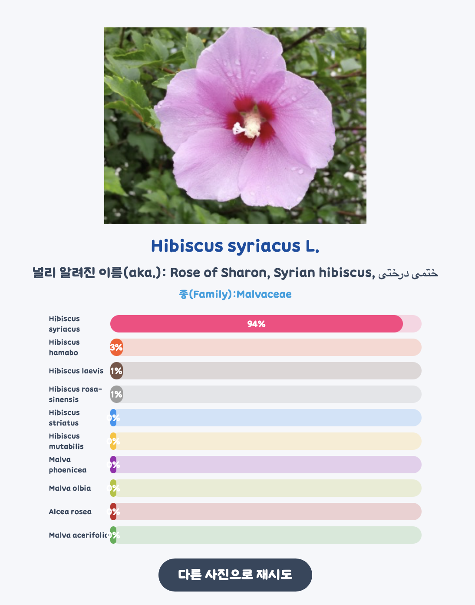

# Plagnosis - Plant Diagnosis Web Service


https://plantscan-9d081.web.app

Plagnosis is a web service that simplifies the process of identifying plants. Whether you are a gardening enthusiast, a botanist, or simply curious about the flora around you, Plagnosis can help you discover the scientific name, commonly used name, and family of a plant in just a few seconds.

## Table of Contents

- [Introduction](#plagnosis---plant-diagnosis-web-service)
- [How It Works](#how-it-works)
- [Why Plagnosis](#why-plagnosis)
- [Getting Started](#getting-started)
  - [Firebase Deployment](#firebase-deployment)
- [Usage](#usage)
- [Web Demo](#demo-test)
- [Web Demo for Everyone](#web-demo-for-everyone)
- [Contributing](#contributing)
- [License](#license)
- [Acknowledgements](#acknowledgements)

## How It Works

Plagnosis is a web-based plant identification service that leverages advanced image recognition algorithms to identify plants based on pictures provided by the user. The basic algorithm is as follows:

1. **Input Picture**: I created this service to allow users to take a picture of a plant using their device's camera or upload an existing image.

2. **Send it to Pl@ntNet API**: The input picture is sent to the Pl@ntNet API, where it is processed using machine learning models and image recognition technology.

3. **Get Result**: The API returns the plant's scientific name, commonly used name, and family.

4. **Show it to People**: The results are displayed on the web page for the user to see.

I continuously strive to improve and expand the plant database and image recognition capabilities, making Plagnosis an invaluable tool for plant enthusiasts.

## Why Plagnosis

Plagnosis was born out of my desire to simplify plant identification. As a member of the "Plants Lover Club," I noticed the challenge of identifying plants within the club. With a wide variety of plants, each having its own unique characteristics, identifying them accurately was often a time-consuming and frustrating task. Plagnosis aims to bridge this gap and make plant identification quick and easy for everyone.

## Getting Started

### Firebase Deployment

1. Clone the Plagnosis repository to your local machine:

   ```bash
   git clone https://github.com/cocomon3448/plagnosis.git
   ```

2. Navigate to the project directory:

   ```bash
   cd plagnosis
   ```

3. Make sure you have the Firebase CLI installed. If not, you can install it with:

   ```bash
   npm install -g firebase-tools
   ```

4. Log in to your Firebase account or create one if you haven't already:

   ```bash
   firebase login
   ```

5. Initialize a Firebase project:

   ```bash
   firebase init
   ```

   - Select the Firebase features you want to use. In your case, you will need Hosting.
   - Choose an existing project or create a new one on the [Firebase console](https://firebase.google.com).
   - Set the public directory to the location where your web application is located (usually a "public" directory).
   - Configure - It is not single page app

6. Before you deploy:

   - In file [index.js](public/js/index.js) line 9, you should change the API key to yours. ([Visit Pl@nt Net Dev page](https://my.plantnet.org))
   - Then visit again to Pl@ntNet API dev page, go mypage -> settings, and then add your domain. (BEWARE OF THIS. API WILL NEVER SHOW RESULT IF YOU FORGET THIS)
   

8. Deploy your Plagnosis web service to Firebase:

   ```bash
   firebase deploy
   ```

9. Once the deployment is complete, Firebase will provide you with a hosting URL where your Plagnosis web service is accessible.

## Usage

1. Open the Plagnosis web service.

2. Click the "Upload Image" button or use your device's camera to take a picture of the plant.  
(Current Version on github is in Korean, so just click upload logo)

3. Wait a few seconds for the image to be processed and identified.

4. The results, including the scientific name, commonly used name, and family of the plant, will be displayed on the screen.

5. Explore the world of plants and become a better plant enthusiast!

## Demo Test



## Web Demo for Everyone

This is the link for the web-demo.  
I am currently on Free Option(so, one day limit is 500 request)  
https://plantscan-9d081.web.app

## Contributing

I welcome contributions from the community to improve and expand Plagnosis.  
Got CSS design from Jocoding. Special Thanks.

## License

This project is licensed under the MIT License - see the [LICENSE](LICENSE) file for details.

## Acknowledgements

I would like to express my gratitude to the Pl@ntNet team for their support and expertise in plant identification technology. Additionally, I want to thank the "Plants Lover Club" for inspiring this project and providing valuable feedback during its development. I hope Plagnosis helps plant enthusiasts and botanists alike in their quest to identify and learn more about the plant world. In addition, this web is in the demo state, meaning that not whole parts of the project are smooth and clear. (The result may turned out to be wrong.)  


**&copy; MinSeok Cho 2023. All Rights Reserved.**

## 한국어

# Plagnosis - 식물 식별 웹 서비스


Plagnosis는 식물 식별 과정을 간소화하는 웹 서비스입니다. 정원 애호가, 식물학자 또는 주변의 식물에 대해 궁금한 사람 모두에게 학명, 일반적으로 사용되는 이름 및 식물 가족을 몇 초만에 알려줍니다.

이름은 Plant(식물) + Diagnosis(진단하다) 에서 따온 것 입니다.

## 목차

- [소개](#plagnosis---식물-식별-웹-서비스)
- [작동 방식](#작동-방식)
- [Plagnosis를 개발한 이유](#plagnosis를-만든-이유)
- [시작하기](#시작하기)
  - [Firebase 배포](#firebase-배포)
- [사용 방법](#사용-방법)
- [웹 데모](#데모-테스트)
- [모든 사용자를 위한 웹 데모](#모든-사용자를-위한-웹-데모)
- [기여](#기여)
- [라이선스](#라이선스)
- [감사의 글](#감사의-글)

## 작동 방식

Plagnosis는 사용자가 제공한 사진을 기반으로 식물을 식별하기 위해 고급 이미지 인식 알고리즘을 활용하는 웹 기반 식물 식별 서비스입니다. 기본 알고리즘은 다음과 같습니다:

1. **이미지 입력**: 사용자가 디바이스 카메라를 사용하거나 기존 이미지를 업로드하여 식물의 사진을 찍도록 서비스를 만들었습니다.

2. **Pl@ntNet API로 전송**: 입력 이미지는 Pl@ntNet API로 전송되며, 기계 학습 모델과 이미지 인식 기술을 사용하여 처리됩니다.

3. **결과 받기**: API는 식물의 학명, 일반적으로 사용되는 이름 및 족(Family) 정보를 반환합니다.

4. **사용자에게 표시**: 결과는 사용자가 볼 수 있는 웹 페이지에 표시됩니다.

저는 계속해서 식물 데이터베이스와 이미지 인식 기능을 개선하고 확장하여 Plagnosis를 식물 애호가들에게 중요한 도구로 만들기 위해 노력하고 있습니다.

## Plagnosis를 개발한 이유

Plagnosis는 식물 식별을 간소화하고자 하는 의지에서 탄생했습니다. "식물 사랑 동아리" 의 구성원으로, 동아리 내에서 식물 식별의 어려움을 발견했습니다. 각각이 고유한 특성을 가지고 있는 다양한 식물을 정확하게 식별하는 것은 종종 시간이 걸리고 답답한 작업이었습니다. 실제로 동아리가 답사를 나갔을 때, 많은 학우들이 식물의 종류를 식별하는데 많은 어려움이 있었습니다. Plagnosis는 이 간극을 메우고 모두에게 빠르고 쉬운 식물 식별을 제공하기 위한 목표를 가지고 있습니다.
+ 실제로 동아리 시간 때 모르는 식물이 너무 많아 사실 식물을 조사하는데 어려움이 있었습니다. 그리고 실제로 식물의 종류를 한눈에 알아보는 것은 전문가가 아니면 거의 불가능해 보였습니다. 하지만 이 산출물을 이용하면 비전문가도 쉽게 식물의 종류와 그와 관련된 특징을 빠르게 찾아볼 수 있었습니다.
+ 그리고 Plagnosis는 1000만 여 종이 넘는 식물을 분류할 수 있고 체계화된 Pl@ntNet 모델이 이를 몇 초안에 프로세싱 해주어, 시간 단축에 용이한 측면도 있었습니다.

## 시작하기

### Firebase 배포

1. 로컬 머신에 Plagnosis 리포지토리를 복제합니다:

   ```bash
   git clone https://github.com/cocomon3448/plagnosis.git
   ```

2. 프로젝트 디렉터리로 이동합니다:

   ```bash
   cd plagnosis
   ```

3. Firebase CLI를 설치했는지 확인합니다. 그렇지 않은 경우 다음 명령을 사용하여 설치할 수 있습니다:

   ```bash
   npm install -g firebase-tools
   ```

4. Firebase 계정에 로그인하거나 계정이 없는 경우 만듭니다:

   ```bash
   firebase login
   ```

5. Firebase 프로젝트를 초기화합니다:

   ```bash
   firebase init
   ```

   - 사용하려는 Firebase 기능을 선택합니다. 여기서는 Hosting이 필요합니다.
   - 기존 프로젝트를 선택하거나 Firebase 콘솔에서 새 프로젝트를 만듭니다.
   - 웹 애플리케이션이 위치한 공개 디렉토리를 설정합니다 (일반적으로 "public" 디렉토리).
   - 프로젝트 구성 - 단일 페이지 앱(SPA)으로 설정하지 않습니다.

6. 배포하기 전에 다음을 수행해야 합니다:

   - [index.js](public/js/index.js) 파일의 9번째 줄에서 API 키를 변경해야 합니다. ([Pl@ntNet 개발 페이지 방문](https://my.plantnet.org))
   - 그런 다음 다시 Pl@ntNet API 개발 페이지를 방문하여 내 페이지 -> 설정으로 이동하고 도메인을 추가합니다. (이 부분을 잊어버리면 API가 결과를 표시하지 않을 수 있으니 주의하세요)
   - 만약 테스트 환경에 맞춰 도메인을 설정해주시면 됩니다(local이면 https://localhost:포트번호 이런식)

8. Plagnosis 웹 서비스를 Firebase에 배포합니다:

   ```bash
   firebase deploy
   ```

9. 배포가 완료되면 Firebase는 Plagnosis 웹 서비스가 액세스 가능한 호스팅 URL을 제공합니다.

## 사용 방법

1. Plagnosis 웹 서비스를 엽니다.

2. "이미지 업로드" 버튼을 클릭하거나 디바이스 카메라를 사용하여 식물의 사진을 찍습니다.

3. 이미지가 처리되고 식별되는 데 몇 초를 기다립니다.

4. 결과, 즉 식물의 학명, 일반적으로 사용되는 이름 및 족(Family)이 화면에 표시됩니다.

5. 식물 세계를 탐험하고 더 나은 식물 애호가가 되세요!

## 데모 테스트


## 모든 사용자를 위한 웹 데모

이것은 웹 데모의 링크입니다.  
현재 무료 옵션을 사용하고 있으므로 (하루 제한 500개 요청) 너무 많이 요청하지 마십시오.  
https://plantscan-9d081.web.app

## 기여

Plagnosis를 개선하고 확장하기 위해 커뮤니티의 기여를 환영합니다.  
조코딩님 css 디자인 참고했습니다. 감사합니다.

## 라이선스

이 프로젝트는 MIT 라이선스에 따라 라이선스가 부여됩니다. 자세한 내용은 [LICENSE](LICENSE) 파일을 참조하십시오.

## 감사의 글

식물 식별 기술에서의 지원과 전문 지식을 제공해 주신 Pl@ntNet 팀에 깊은 감사를 표합니다. 또한 이 프로젝트를 영감을 주고 개발 과정에서 소중한 피드백을 제공해 준 "식물 사랑 동아리"에게도 감사드립니다. 이 웹 서비스는 아직 데모 상태이며 프로젝트 전체의 일부 부분이 원활하고 명확하지 않을 수 있음을 참고하시기 바랍니다. (결과가 잘못 나올 수 있습니다.)  


**&copy; 조민석 2023. All Rights Reserved.**
